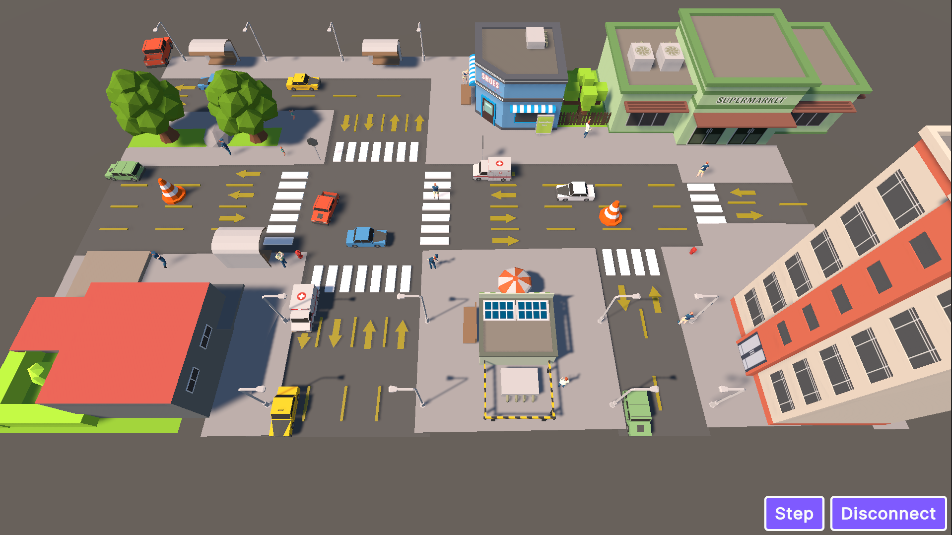
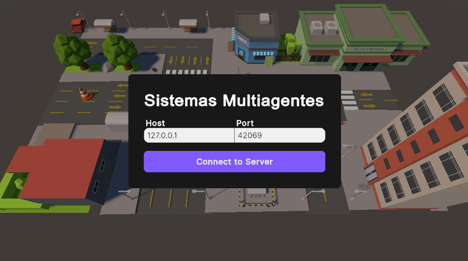

# Reto Multiagentes

## Overview

This project presents a simulation of a street intersection with a pedestrian crossing, implemented as a multi-agent simulation using **agentpy**. The visualization is handled through **Unity**.



## Running the project

### Dependencies

You will need **Python 3.11 or higher** to run the simulation.

1. Navigate to the `Simulation/` directory.
2. Install the required Python dependencies by running:

```bash
pip install -r requirements.txt
```

For the visualization, you will need to install the **Unity Editor version 6000.0.33f1 or later**. Open the `Visualization/` directory using **Unity Hub** and run the project.

### Server

The simulation runs on a Python server that listens on port **42069** by default.

To start the server and the simulation, run:

```bash
python main.py
```

The server listens for a TCP socket connection and accepts the first incoming client. Once connected, it accepts two text-based commands:

* `start`
* `step`

The `start` command initializes the simulation or restarts it if an existing simulation is already running.
The `step` command advances the simulation by one time step.

Both commands cause the server to send the complete simulation state as a JSON object, which includes all agents with their **IDs**, **positions**, and **types**.

When the socket connection is closed, the server process terminates automatically.

### Visualization

When running the Unity project, you will be prompted to enter the **IP address** and **port** of the server (default values are provided). Modify these only if you have changed them in the Python code.



After entering the connection details, click **Connect to Server**. The simulation will begin immediately and advance automatically through time steps.


